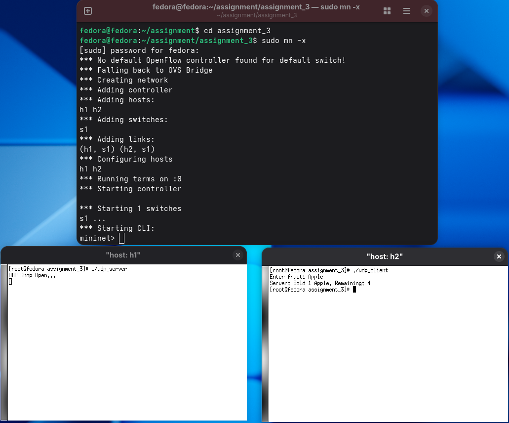
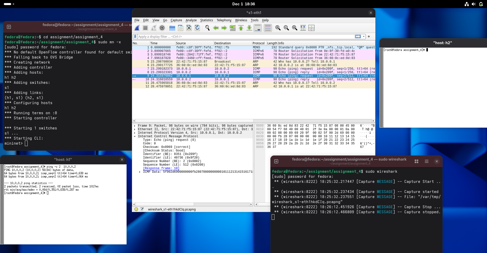
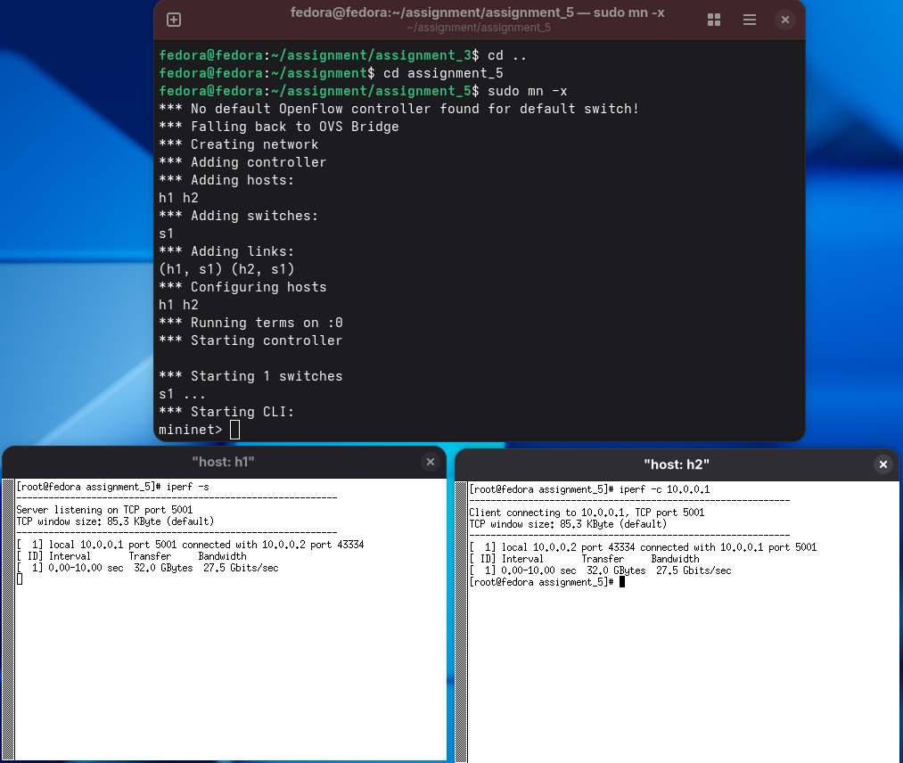
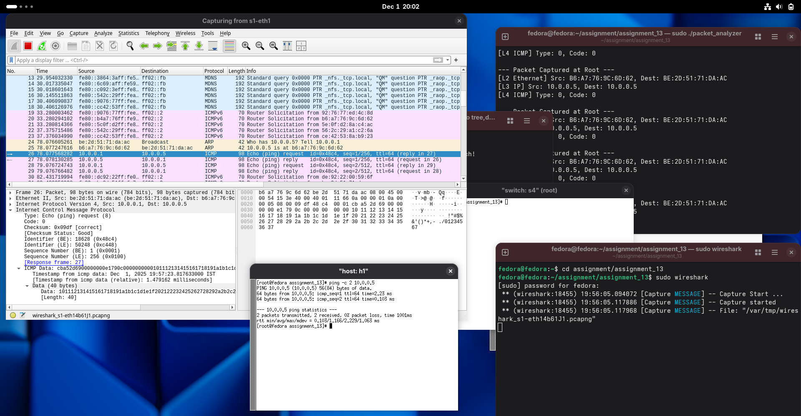
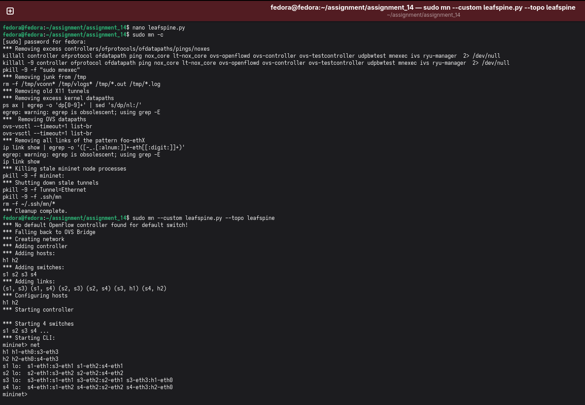

Kritabh Kaushal (CSM24067)
Assignment of CN Lab

🧪 Assignment 1: TCP Client–Server Socket Programming
Objective
To gain first hands-on experience of basic socket programming.

Exercise
Write a program to run TCP client and server socket programs where the client first sends “Hi” and the server responds with “Hello”.

Description
Two Mininet hosts are created. The server listens continuously for client connections. The client connects to the server, sends the greeting message, and receives the reply.

Commands & Steps
gcc server.c -o server
gcc client.c -o client
sudo mn
mininet> xterm h1 h2

Run ./server on h1 and ./client on h2.

Output

 ---

🧪 Assignment 2: TCP Socket Programming – Fruit Store Application
Objective
To gain experience of TCP socket programming for simple applications.

Exercise
Write a program using TCP socket to implement the following:

Server maintains records of fruits in the format: fruit-name, quantity, last-sold timestamp
Multiple clients purchase fruits one at a time
Fruit quantity is updated after every transaction
Regret message is sent if requested quantity is not available
Display customer IDs <IP, Port>
Display total number of unique customers after every transaction
Description
The server maintains fruit inventory and tracks client information dynamically.

Commands & Steps
gcc server.c -o server
gcc client.c -o client
sudo mn --topo single,4
mininet> xterm h1 h2 h3 h4

Output

---

🧪 Assignment 3: UDP Socket Programming – Fruit Store
Objective
To gain experience of UDP socket programming.

Exercise
Redo Assignment 2 using UDP sockets.

Description
UDP sockets are used without connection establishment.

Commands & Steps
gcc server.c -o server
gcc client.c -o client
sudo mn --topo single,4
mininet> xterm h1 h2 h3 h4

Output

---

🧪 Assignment 4: Packet Capture and Header Analysis
Objective
To gain knowledge of packet capturing tools and protocol headers.

Exercise
Install Wireshark and capture packets during a PING operation.

Commands & Steps
wireshark &
ping 8.8.8.8

Output
Headers

Time Diagram

                 Host 1 (Source)                      Host 2 (Destination)
                 ----------------                    ---------------------

                       |                                      |
                       |   Initialization & Capture Start     |
                       |------------------------------------->|
                       |                                      |
                       |   ARP Resolution (if cache empty)    |
                       |------------------------------------->|
                       |                                      |
                       | ARP Request: Who has H2 IP?          |
                       | (Broadcast)                           |
                       |------------------------------------->|
                       |                                      |
                       | ARP Reply: H2 is at <MAC Address>    |
                       | (Unicast)                             |
                       |<-------------------------------------|
                       |                                      |
                       |        ICMP Echo Process (Ping)      |
                       |                                      |
                       | ICMP Echo Request (Type 8, Seq 1)    |
                       |------------------------------------->|
                       | ICMP Echo Reply   (Type 0, Seq 1)    |
                       |<-------------------------------------|
                       |                                      |
                       | ICMP Echo Request (Type 8, Seq 2)    |
                       |------------------------------------->|
                       | ICMP Echo Reply   (Type 0, Seq 2)    |
                       |<-------------------------------------|
                       |                                      |
                       | ICMP Echo Request (Type 8, Seq 3)    |
                       |------------------------------------->|
                       | ICMP Echo Reply   (Type 0, Seq 3)    |
                       |<-------------------------------------|
                       |                                      |
                       | ICMP Echo Request (Type 8, Seq 4)    |
                       |------------------------------------->|
                       | ICMP Echo Reply   (Type 0, Seq 4)    |
                       |<-------------------------------------|
                       |                                      |
                 ----------------                    ---------------------
                 Host 1 (Source)                      Host 2 (Destination)

---

                 
🧪 Assignment 5: Packet Generation Tools
Objective
To gain knowledge of packet generation tools.

Exercise
Install and use Iperf and D-ITG to generate traffic.

Commands & Steps
iperf -s
iperf -c
ITGRecv
ITGSend -a -T UDP -C 100 -c 512

Output
Iperf
D-ITG
Packet Capture

---

🧪 Assignment 6: TCP/IP Libraries and Traffic Analysis
Objective
To gain knowledge of TCP/IP C libraries.

Exercise
Develop a C-based network simulator to analyze TCP traffic.

Commands & Steps
gcc traffic.c -o traffic
sudo ./traffic

Output

---

🧪 Assignment 7: UDP Scientific Calculator
Objective
Client–server communication using UDP packets.

Exercise
Write a UDP client-server program for scientific calculations.

Commands & Steps
gcc server.c -o server -lm
gcc client.c -o client
sudo mn --topo single,2

Output

---
🧪 Assignment 8: Multi-threaded TCP Chat Server
Objective
To understand multi-threading using TCP sockets.

Exercise
Develop a TCP chat server with multiple clients.

Commands & Steps
gcc server.c -o server -lpthread
gcc client.c -o client
sudo mn --topo single,4

Output

---

🧪 Assignment 9: File Upload and Download Using TCP
Objective
To perform file transfer using TCP.

Exercise
Upload and download files and calculate transfer time.

Commands & Steps
gcc server.c -o server
gcc client.c -o client
sudo mn

Output

---

🧪 Assignment 10: RAW Socket Packet Generation
Objective
To generate custom TCP and ICMP packets.

Exercise
Create TCP packets with payload and ICMP timestamp packets.

Commands & Steps
gcc tcp_socket.c -o tcp
gcc icmp.c -o icmp
sudo ./tcp
sudo ./icmp

Output

---

🧪 Assignment 11: TCP SYN Flood Attack
Objective
To understand TCP flooding attacks.

Exercise
Generate TCP SYN flood using RAW sockets.

Commands & Steps
gcc flood.c -o flood
sudo ./flood

Output

---
🧪 Assignment 12: ICMP Flooding Attack
Objective
To understand ICMP flooding attacks.

Exercise
Generate ICMP flooding traffic.

Commands & Steps
gcc rawsocket.c -o icmp_flood
sudo ./icmp_flood

Output

---

🧪 Assignment 13: Binary Tree Topology Packet Analysis
Objective
To analyze packets in a binary tree topology.

Exercise
Create binary tree topology and analyze packets.

Commands & Steps
sudo python3 topo.py
gcc analyzer.c -o analyzer
sudo ./analyzer

Output

---

🧪 Assignment 14: Leaf–Spine Topology in Mininet
Objective
To create scalable custom topologies.

Exercise
Design a scalable leaf–spine topology using Mininet API.

Commands & Steps
sudo python3 leaf_spine_topology.py
sudo python3 visualizer.py

